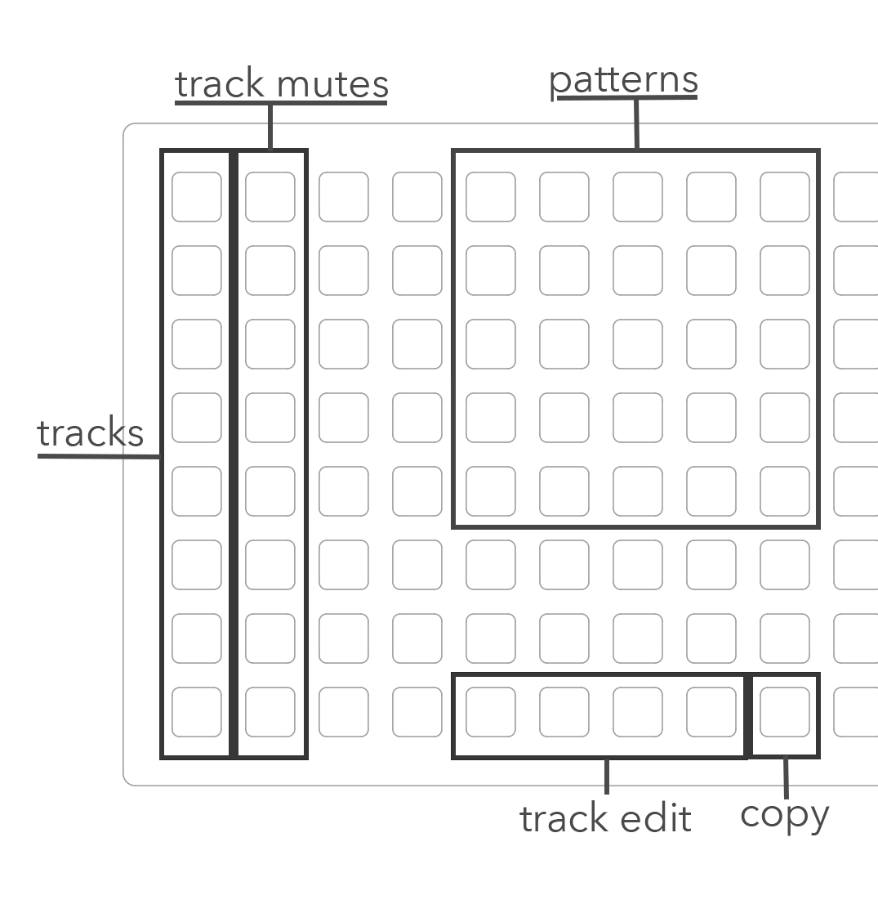

---
---

# foulplay

a euclidean sample instrument with trigger conditions.
based on tehn/playfair.

samples can be loaded via PARAMETERS in the main menu.

---
---

## home

when first starting foulplay you will be greeted with 8 tracks for euclidean rhythms. this is **home**. 

while **home**, KEY3 is ALT.

- ENC1 selects which track to focus.
- ENC2 sets the number of hits.
- ENC3 sets the track length.
- KEY2 starts and stops the clock.

- ALT + ENC1 sets the mix volume level.
- ALT + ENC2 sets the track rotation value.
- ALT + ENC3 sets the track bpm.
- ALT + KEY2 is track reset.
---

## track edit

holding KEY1 will bring up the **track edit** screen, releasing KEY1 will return **home**.

**track edit** is where you will find trigger conditions and probability settings, as well as various track specific parameters.

in **track edit** parameters 1-3 are tied to their respective encoders.

- KEY2 advances to the next track.
- KEY3 advances to the next **track edit** page. 

---

# grid 
(coded by @junklight)

column 1 selects which track to edit.
column 2 provides track mute toggles. 

buttons 4-7 on the bottom row bring up track edit pages 1-4.
button 8 on the bottom row is copy.

the pattern area is a 5x5 grid of memory cells, allowing for storing/ recalling patterns.
to copy a pattern to a new cell hold the copy button and press the cell you wish to copy. 
the cell will blink. while still holding copy, press the desired destination cell. release
copy to return to normal use.

---

# extended explanations

### saving/ loading your work

foulplay will automatically save its _current state*_ whenever (a) you switch scripts, or (b) when norns _sleeps_. 
loading is also automatic, and will happen anytime that you load foulplay.

* foulplays current state includes the 25 memory cells, and their data.

### trig logic & probability

on page 2 of **track edit** you will find the trig logic and probability settings.

- ENC1 selects which logic to use. either **none**, **and**, **or**, **nand**, **nor**, or **xor**.
- ENC2 selects which track to apply the logic to. you must have trig logic turned on to access this one.
- ENC3 sets the trig probability. this is also applied to logic derived trigs.
