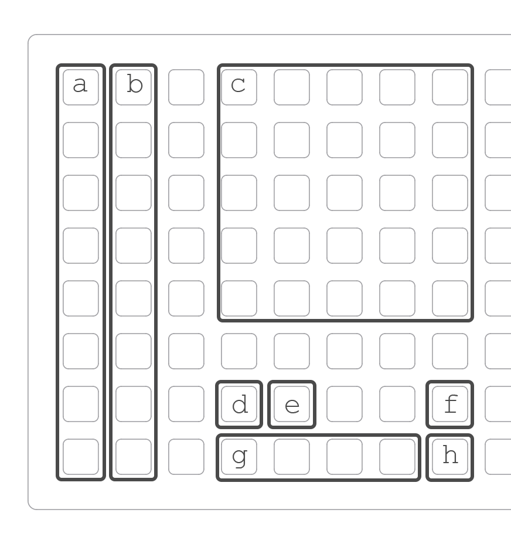

---
---

# foulplay

a euclidean instrument with trigger conditions.
based on tehn/playfair.

samples can be loaded via PARAMETERS in the main menu.

---
---

## home

when first starting foulplay you will be greeted with 8 tracks for euclidean rhythms. this is **home**. 

while **home**, KEY3 is ALT.

- ENC1 selects which track to focus.
- ENC2 sets the number of hits.
- ENC3 sets the track length.
- KEY2 starts and stops the clock.

- ALT + ENC1 sets the mix volume level.
- ALT + ENC2 sets the track rotation value.
- ALT + ENC3 sets the track bpm.
- ALT + KEY2 is track reset.
---

## track edit

each track can be configured to either send midi or trigger a sample.
please see the PARAMETERS menu for configuration.

holding KEY1 will bring up the **track edit** screen, releasing KEY1 will return **home**.
 
**track edit** is where you will find trigger conditions and probability settings, as well as various sample specific parameters. 
if sending midi, **track edit** will contain shortcuts for setting the midi channel and note.

in **track edit** parameters 1-3 are tied to their respective encoders.

- KEY2 advances to the next track.
- KEY3 advances to the next **track edit** page. 

---

# grid 
(coded by @junklight)

* a. track select column
* b. track mute toggle column
* c. pattern and pset select area
* d. start / stop button
* e. phase reset button
* f. pset load button
* g. track edit pages
* h. copy button

pressing a button in section **a** will select which track to focus for editing. tracks are numbered top to bottom, 1-8.

pressing a button in section **b** will mute or unmute the adjacent track in section **a**.

section **c** is a multi-function area containing 25 buttons numbered from left to right, top to bottom. if no modifiers are held, pressing a button in section **c** will load the corresponding pattern data.

pressing **d** will start or stop the clock.

pressing **e** will reset all tracks to 1.

**f** is a modifier button for section **c**. holding **f** and pressing in section **c** will load the corresponding pset data.

the buttons in section **g** open track edit pages for your currently selected track.

**h** is a modifier button for section **c**, allowing for copy/paste behavior. holding **h** and pressing a pattern in section **c** will copy the selected pattern. while still holding **h**, press the desired pattern location to paste.

---

### saving/ loading your work

foulplay will automatically save its _current state*_ whenever (a) you switch scripts, or (b) when norns _sleeps_. 
loading is also automatic, and will happen anytime that you load foulplay.

*foulplays current state includes the 25 memory cells, accessible via grid, and their data.*
