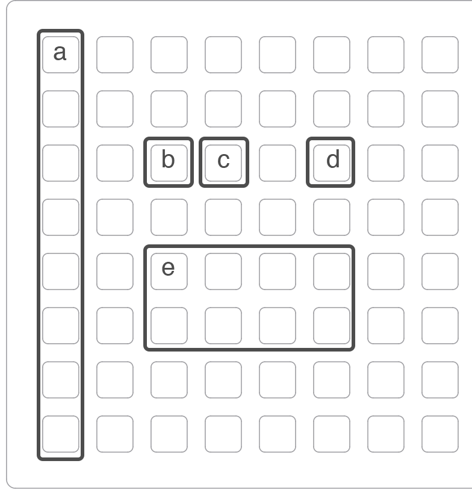
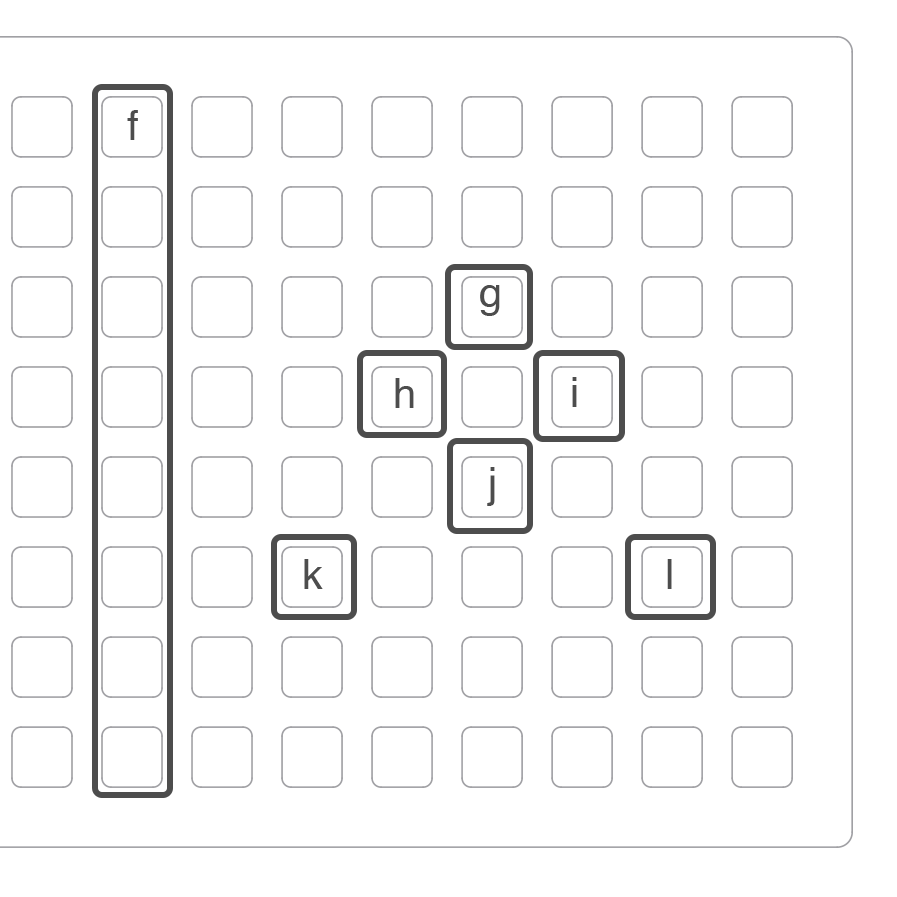

### strides

---

strides is a 4 track finger drum pattern recorder for norns.

---

## norns

- key1 = hold to access secondary encoder functions
	* enc1 = main volume / distortion amount
	* enc2 = delay time / delay level
	* enc3 = delay feedback / delay send
- key2 = half time
- key3 = double time

nb: delay send works on all samples and tracks. if you wish to send individual samples to delay, you can do so via the PARAMETERS menu.

---

## grid

hold alt to access secondary grid functions. 

- a - track selection / track stop
- b - arm record / clear all patterns
- c - start/stop selected track / stop all tracks
- d - sample pads
- e - alt

as well as secondary controls, holding alt will bring up several controls for pattern and sample playback speed manipulation.

- f - toggle pattern linearization 
- g - double sample playback speed
- h - half pattern speed
- i - double pattern speed
- j - half sample playback speed
- k - restore pattern speed to original or linearized if selected
- l - restore all sample playback speed to original
