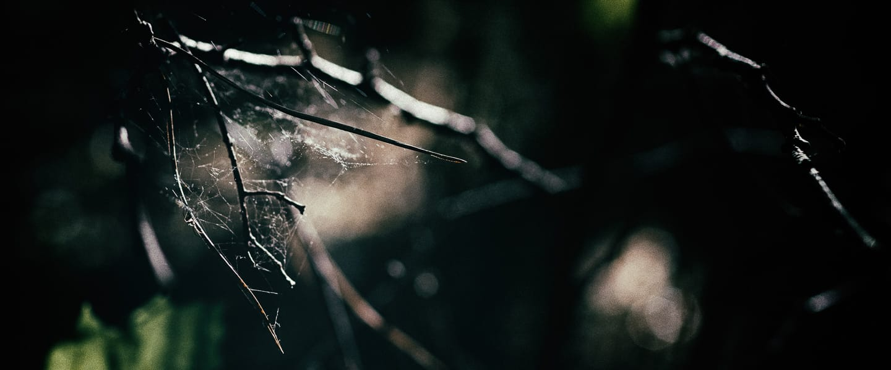

---
---

# haven.

a safe space?

## What?

+ 2 unique oscillators: one high, one low.
+ 1 self-oscillating feedback loop with built-in ladder filter, smearing the pitch of the oscillators.
+ audio in.

## Control?

No. But a lot of influence.

## Seriously?

Yes, but:

+ KEY_1 — (thy olde) toggle
+ KEY_2 — next control set
+ KEY_3 — hold for extra-fine influence
+ ENC_1 — (thy olde) main volume
+ ENC_2 — influence frequency (or feedback)
+ ENC_3 — influence amplitude

## Who?

Sound engine by [LFSaw.de](http://lfsaw.de) ([Till Bovermann](http://tai-studio.org)), GUI and awesome general help by [artfwo](https://github.com/artfwo).

